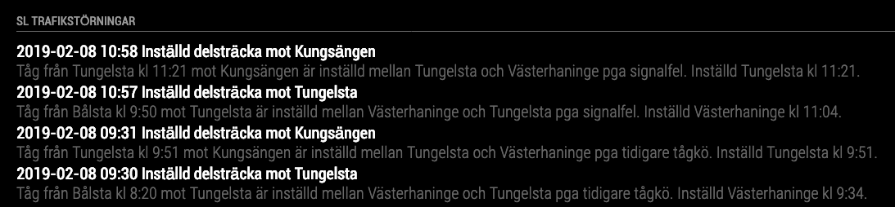

# Module: MMM-SL-Deviations
SL traffic deviations in Stockholm. This module use the API's provided by Trafiklab.

## Screenshot


## Get API Key
Get an API key from Trafiklab for API https://www.trafiklab.se/api/sl-storningsinformation-2

## Install
1. Clone repository into ../modules/ inside your MagicMirror folder.
1. Run npm install inside ../modules/MMM-SL-Deviations/ folder
1. Add the module to the MagicMirror config

## Configuration

```javascript

modules: [
...
    {
      module: "MMM-SL-deviations",
      position: "bottom_bar",
      header: "SL Trafikstörningar",
      config: {
        updateInterval: 5 * 60 * 1000,
        uiUpdateInterval: 5000,
        apikey: "your api key",
        transportMode: <transportmode>, // ie train
        line: <line>, // ie. 43
        divClass: "small bright",
        headerClass: "",
        createdClass: "light small dimmed",
        detailsClass: "light small dimmed"
      }
    },
]
```
